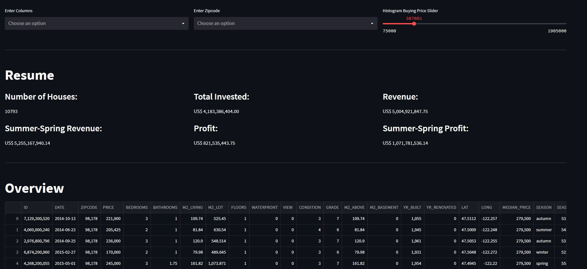
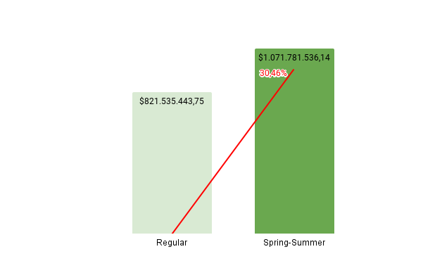

# P001_House_Rocket_Insights

_Seattle Skyline._

## Summary
* [1. Business Problem](#1-business-problem)
* [2. Business Assumptions](#2-business-assumptions)
* [3. Solution Strategy](#3-solution-strategy)
* [4. Main Insights](#4-main-insights)
* [5. Financial Impact](#5-financial-impact)
* [6. Deployment and Conclusion](#6-deployment-and-conclusion)
* [7. Next Steps](#7-next-steps)
* [8. References](#8-references)

## 1. Business Problem

House Rocket is a fictional real state company based in Seattle, USA. The business model of the company is first purchasing properties with good condition and bellow 
market's price, and then sell the properties with a profit margim. House Rocket leverages technology to find the best opportunities and at what price the real state
should be negotiated.

For this project, the business team has a large portfolio to evaluate and it would take to much time to do it manually. In addition, they've requested BI team to built a 
solution that both business team and C-Levels (i.e., CEO, CFO and COO) could analyze and take decisions.

Thus, BI team suggested that an online [dashboard](https://p001-house-rocket-insights.onrender.com/) was the best way to deliver the solution and the content must have:
* Quantity of real state;
* Total value invested;
* Total revenue;
* Total profit.

_Dashboard header view._

## 2. Business Assumptions

* In total, there were 21,613 properties available on the initial portfolio;
* Seasons of the year:
  * Spring runs from March 1 to May 31;
  * Summer runs from June 1 to August 31;
  * Autumn runs from September 1 to November 30;
  * Winter runs from December 1 to February 28 (February 29 in a leap year).
* The decisions were based on value invested and total profit. The profit margin was based on size and season, but condition, grade, location are also good indicators
of the best properties.

## 3. Solution Strategy
  1. Business Problem
  2. Business Understanding
  3. Collecting Data
  4. Data Understanding 
  5. Feature Engineering
  6. Exploratory Data Analyzis
  7. Conclusion and Insights 
  8. Deployment of [Solution](https://p001-house-rocket-insights.onrender.com/)
  
## 4. Main Insights
* Waterfront properties are more expensive than non-waterfront properties;
* Houses that have basement are bigger and bigger houses are more expensive. Therefore, houses that have basement are expensive;
* Houses with higher grade are expensive;
* Properties with bad view (no view or fair) are cheaper;
* Nothern houses are expensive;

## 5. Financial Impact
From the initial **21,613** real estate, the BI team recommends **10,793 (~50%)** of them. The total value to be invested is **US$ 4,183,386,404.00** and the revenue expectation is at least **US$ 5,004,921,847.75** which means a **19.63%** Return Over Investment (ROI). Furthermore, the team also understands that Spring-Summer Season are the best time to sell and revenue could reach **US$ 5,255,167,940.14**, an addition of **30.46%** on profit. 

## 6. Deployment and Conclusion
The [dashboard](https://p001-house-rocket-insights.onrender.com/) was built with Python and Streamlit and deployed on Render. This platform is responsible for hosting the application on Cloud, this way all stakeholders can check the dashboard from their computers and smartphones anywhere and anytime. 

The business team should analyse and decide which real estate they will invest.

## 7. Next Steps
* Improve dashboard speed;
* Add new filters;
* Add grade info on map tags;
* Add if the property has basement or not on map tags;
* Add view info on map tags;
* Add if is waterfront on map tags.

## 8. References
* Dataset available on [Kaggle](https://www.kaggle.com/datasets/harlfoxem/housesalesprediction);
* Data columns description on [Kaggle](https://www.kaggle.com/datasets/harlfoxem/housesalesprediction/discussion/207885) discussion;
* This project is part of [Comunidade DS](https://comunidadeds.com/).

